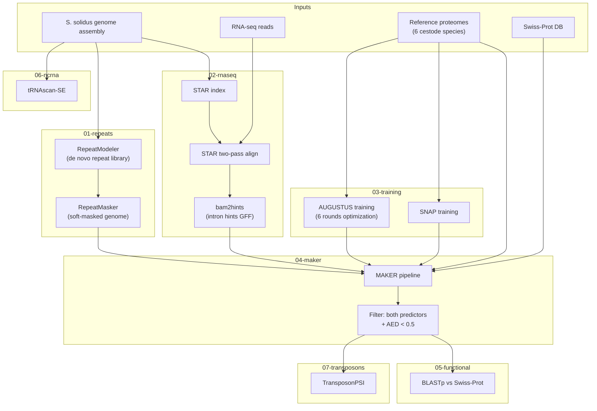

# *Schistocephalus solidus* genome annotation pipeline

Structural and functional annotation of a newly assembled *S. solidus* genome,
following the methods of
[Nazarizadeh et al. (2024)](https://doi.org/10.1098/rspb.2023.2563)
(*Ligula intestinalis* annotation) adapted for *S. solidus*.

## Pipeline overview



## Directory layout

| Directory | Purpose |
|-----------|---------|
| `config.sh` | Global paths and settings sourced by every script |
| `01-repeats/` | Repeat identification (RepeatModeler) and masking (RepeatMasker) |
| `02-rnaseq/` | RNA-seq alignment (STAR two-pass) and intron hint extraction (bam2hints) |
| `03-training/` | *Ab initio* predictor training (AUGUSTUS, SNAP) |
| `04-maker/` | MAKER annotation pipeline and post-hoc filtering |
| `05-functional/` | Functional annotation (BLASTp vs Swiss-Prot) |
| `06-ncrna/` | tRNA prediction (tRNAscan-SE) |
| `07-transposons/` | Transposon identification in proteins and genome (TransposonPSI) |
| `help/` | Local tool manuals (gitignored, not versioned) |

## Quick start

1. Edit `config.sh` — set paths for your genome assembly, RNA-seq reads,
   reference proteomes, Swiss-Prot database, and thread count.
2. Run each numbered step in order. Within each directory, scripts are numbered
   sequentially (e.g. `01_repeatmodeler.sh` before `02_repeatmasker.sh`).
3. See the README in each subdirectory for parameter discussion and usage.

```bash
# Example: run step 1
cd 01-repeats
bash 01_repeatmodeler.sh
bash 02_repeatmasker.sh
```

## Reference species

The pipeline uses coding sequences and proteomes from six cestode relatives for
training gene predictors and as protein evidence in MAKER.

| Label | Species | Order | Notes |
|-------|---------|-------|-------|
| lint | *Ligula intestinalis* | Diphyllobothriidea | Closest relative (same family) |
| spro | *Sparganum proliferum* | Diphyllobothriidea | Chromosome-level assembly |
| dlat | *Dibothriocephalus latus* | Diphyllobothriidea | Same order; used in Nazarizadeh et al. |
| seri | *Spirometra erinaceieuropaei* | Diphyllobothriidea | Same order; used in Nazarizadeh et al. |
| hmic | *Hymenolepis microstoma* | Cyclophyllidea | Model cestode, good annotation |
| egra | *Echinococcus granulosus* | Cyclophyllidea | Well-studied reference genome |

Reference genomes are managed by the sibling `../genomes/` repository. Run its
download and BLAST-DB scripts to populate proteome and CDS files before starting
this pipeline.

## Parameter decisions at each step

### 01 — Repeat masking

- **RepeatModeler** runs with default parameters and the NCBI/rmblast engine to
  build a *de novo* repeat library from the assembly.
- **RepeatMasker** uses `-xsmall` (soft-masking, lowercase) rather than
  hard-masking (`-x`, replace with Ns). Soft-masking is preferred because MAKER
  can still use evidence from masked regions when support is strong. The custom
  repeat library (`-lib`) from RepeatModeler is used; supplement with
  `-species` only if a suitable Repbase/Dfam cestode library is available.

### 02 — RNA-seq alignment

- **STAR two-pass mode** (`--twopassMode Basic`) improves splice-junction
  detection as described in the source paper.
- `--sjdbOverhang` = read length - 1 (e.g. 149 for 150 bp reads).
- `--genomeSAindexNbases` should be reduced for genomes smaller than human
  (default 14); ~12-13 is appropriate for the ~540 Mb *S. solidus* genome.
- **bam2hints** (`--intronsonly`) extracts intron hints in GFF for AUGUSTUS
  within the MAKER pipeline.

### 03 — Predictor training

- **AUGUSTUS** is trained with `new_species.pl`, `etraining`, and
  `optimize_augustus.pl --rounds=6` (matching the paper's six optimization
  rounds). Training genes are derived from reference CDS aligned to the masked
  genome.
- **SNAP** is trained with `fathom`, `forge`, and `hmm-assembler.pl` using the
  same evidence set converted to ZFF format.
- An alternative iterative approach is supported: run MAKER round 1 with
  default predictors, then retrain on the initial gene set, then run MAKER
  round 2 with the improved models.

### 04 — MAKER

- Protein evidence combines Swiss-Prot peptides with predicted proteins from
  the six reference cestode species.
- `est2genome=0` and `protein2genome=0` — use trained *ab initio* predictors
  rather than evidence-based gene building.
- Post-hoc filtering keeps only genes predicted by **both** AUGUSTUS and SNAP,
  with AED (Annotation Edit Distance) < 0.5, matching the paper's criteria for
  high-confidence predictions.

### 05 — Functional annotation

- Predicted proteins are searched against Swiss-Prot with `blastp -evalue 1e-5`.
- MAKER utilities (`maker_functional_gff`, `maker_functional_fasta`) map BLAST
  hit descriptions back onto the GFF3 and FASTA outputs.

### 06 — tRNA prediction

- **tRNAscan-SE** is run in eukaryotic mode (`-E`). Use `-O` for organellar
  tRNAs if mitochondrial annotation is desired.

### 07 — Transposon analysis

- **TransposonPSI** is run on both the genome (`nuc` mode) and the predicted
  protein set (`prot` mode) to identify transposon-derived sequences that may
  be false-positive gene predictions.

## Software

All tools are installed on the server via conda. Key software versions (from the
reference paper unless otherwise noted):

| Tool | Version (paper) | Purpose |
|------|-----------------|---------|
| RepeatModeler | 2.0.1 | *De novo* repeat library construction |
| RepeatMasker | 4.1.0 | Repeat classification and genome masking |
| AUGUSTUS | 2.5.5 | *Ab initio* gene prediction and training |
| SNAP | 2006-07-28 | *Ab initio* gene prediction |
| STAR | 2.7 | RNA-seq splice-aware alignment |
| MAKER | (latest) | Annotation pipeline integrating evidence and predictors |
| tRNAscan-SE | 2.05 | tRNA prediction |
| TransposonPSI | (latest) | Transposon homology detection |
| BLAST+ | (latest) | Sequence similarity searches |
